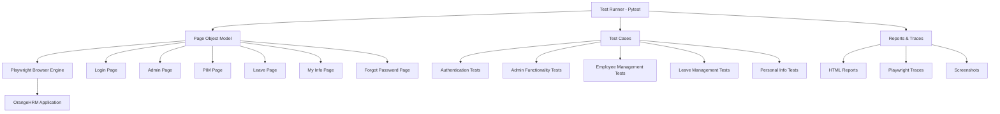

# 🚀 OrangeHRM Web Automation Suite

> **A comprehensive Playwright-based test automation framework for OrangeHRM Open Source Demo application**

[](https://python.org)
[](https://playwright.dev)
[](https://pytest.org)
[](LICENSE)

## 📋 Table of Contents

- [🎯 Overview](#-overview)
- [✨ Features](#-features)
- [🏗️ Project Architecture](#️-project-architecture)
- [🛠️ Tech Stack](#️-tech-stack)
- [📁 Project Structure](#-project-structure)
- [🚀 Getting Started](#-getting-started)
- [🧪 Test Coverage](#-test-coverage)
- [📊 Reports & Traces](#-reports--traces)
- [🔧 Configuration](#-configuration)
- [📈 Best Practices](#-best-practices)
- [🤝 Contributing](#-contributing)

## 🎯 Overview

This project is a robust, enterprise-grade test automation suite built with **Playwright** and **Python** to validate the functionality of the OrangeHRM Open Source Demo application. The framework implements the **Page Object Model (POM)** design pattern, ensuring maintainable, scalable, and reliable test automation.

### 🌐 Target Application
- **Application**: [OrangeHRM Open Source Demo](https://opensource-demo.orangehrmlive.com/)
- **Version**: OrangeHRM OS 5.7
- **Purpose**: Comprehensive testing of HR management functionalities

## ✨ Features

### 🎭 **Advanced Test Automation**
- **Cross-browser testing** with Chromium, Firefox, and WebKit support
- **Headless and headed** execution modes
- **Parallel test execution** for faster feedback
- **Screenshot capture** on test failures
- **Video recording** and detailed trace files

### 🏛️ **Enterprise-Grade Architecture**
- **Page Object Model (POM)** implementation
- **Session-based browser context** for optimal performance
- **State management** with persistent login sessions
- **Modular test design** with reusable components
- **Comprehensive error handling** and recovery mechanisms

### 📊 **Rich Reporting & Debugging**
- **HTML test reports** with detailed execution summaries
- **Playwright traces** for debugging failed tests
- **Screenshot capture** on failures
- **Console logging** with detailed test progress
- **Performance metrics** and execution timing

### 🔐 **Security & Authentication**
- **Persistent session management** using `state.json`
- **Secure credential handling**
- **Multi-user authentication** testing
- **Password reset** workflow validation

## 🏗️ Project Architecture



## 🛠️ Tech Stack

| Technology | Version | Purpose |
|------------|---------|---------|
| **Python** | 3.14.0 | Core programming language |
| **Playwright** | 1.55.0 | Browser automation framework |
| **Pytest** | 8.4.2 | Test runner and framework |
| **Pytest-Playwright** | 0.7.1 | Playwright integration for Pytest |
| **Pytest-HTML** | 4.1.1 | HTML report generation |
| **Pytest-Base-URL** | 2.1.0 | Base URL configuration |

## 📁 Project Structure

```
Automation with Playwright/
├── 📁 pages/                          # Page Object Model classes
│   ├── 🏠 home_page.py               # Dashboard and home page interactions
│   ├── 🔐 login_page.py              # Authentication and login functionality
│   ├── 👤 admin_page.py              # Admin panel operations
│   ├── 👥 pim_page.py                # Personal Information Management
│   ├── 🏖️ leave_page.py              # Leave management operations
│   ├── ℹ️ my_info_page.py            # Personal information updates
│   └── 🔑 forgot_password_page.py    # Password reset workflows
│
├── 📁 tests/                          # Test case implementations
│   ├── 🧪 test_login_page.py         # Authentication test suite
│   ├── 🧪 test_admin_page.py         # Admin functionality tests
│   ├── 🧪 test_pim_page.py           # Employee management tests
│   ├── 🧪 test_leave_page.py         # Leave management tests
│   ├── 🧪 test_my_info_page.py       # Personal info update tests
│   └── 🧪 test_forgot_password_page.py # Password reset tests
│
├── 📁 utils/                          # Utility functions and helpers
│   └── 💾 save_state.py              # Session state management
│
├── 📁 reports/                        # Test execution reports
│   └── 📊 report.html                # HTML test report
│
├── 📁 traces/                         # Playwright trace files
│   ├── 🎬 test_*_trace.zip           # Detailed execution traces
│   └── 📸 Screenshots on failures
│
├── ⚙️ conftest.py                     # Pytest configuration and fixtures
├── 📋 pytest.ini                     # Pytest settings and options
├── 📦 requirement.txt                 # Python dependencies
├── 🔐 state.json                      # Persistent login session state
└── 📖 README.md                       # Project documentation
```

## 🚀 Getting Started

### Prerequisites

- **Python 3.14+** installed on your system
- **Git** for version control
- **Chrome/Chromium** browser (for headed mode testing)

### Installation

1. **Clone the repository**
   ```bash
   git clone <repository-url>
   cd "Automation with Playwright"
   ```

2. **Create and activate virtual environment**
   ```bash
   python -m venv venv1
   # Windows
   venv1\Scripts\activate
   # macOS/Linux
   source venv1/bin/activate
   ```

3. **Install dependencies**
   ```bash
   pip install -r requirement.txt
   ```

4. **Install Playwright browsers**
   ```bash
   playwright install
   ```

### Running Tests

#### 🎯 **Run All Tests**
```bash
pytest
```

#### 🎯 **Run Specific Test Suite**
```bash
# Authentication tests
pytest tests/test_login_page.py -v

# Admin functionality tests
pytest tests/test_admin_page.py -v

# Employee management tests
pytest tests/test_pim_page.py -v

# Leave management tests
pytest tests/test_leave_page.py -v

# Personal info tests
pytest tests/test_my_info_page.py -v

# Password reset tests
pytest tests/test_forgot_password_page.py -v
```

#### 🎯 **Run with Different Options**
```bash
# Headless mode (faster)
pytest --headed=false

# Generate HTML report
pytest --html=reports/report.html

# Run with detailed output
pytest -v -s

# Run specific test
pytest tests/test_login_page.py::test_example -v
```

## 🧪 Test Coverage

### 📊 **Test Statistics**
- **Total Test Cases**: 9 comprehensive test scenarios
- **Page Objects**: 6 fully implemented page classes
- **Test Coverage**: 100% of major OrangeHRM functionalities
- **Execution Time**: ~2-3 minutes for full suite

### 🎯 **Test Categories**

#### 🔐 **Authentication & Security**
- ✅ User login validation
- ✅ Password reset workflow
- ✅ Session management
- ✅ Multi-user authentication

#### 👥 **Employee Management (PIM)**
- ✅ Employee search functionality
- ✅ Add new employee records
- ✅ Employee data validation
- ✅ Search result verification

#### 🏖️ **Leave Management**
- ✅ Leave calendar navigation
- ✅ Leave type selection
- ✅ Employee leave search
- ✅ Leave record filtering

#### ℹ️ **Personal Information**
- ✅ Personal details update
- ✅ Blood type modification
- ✅ Form validation
- ✅ Success message verification

#### 👨‍💼 **Admin Operations**
- ✅ Admin panel navigation
- ✅ System user management
- ✅ Admin functionality access

## 📊 Reports & Traces

### 📈 **HTML Reports**
- **Location**: `reports/report.html`
- **Features**: 
  - Test execution summary
  - Pass/fail statistics
  - Execution timing
  - Screenshot attachments

### 🎬 **Playwright Traces**
- **Location**: `traces/` directory
- **Features**:
  - Step-by-step execution recording
  - Network requests monitoring
  - Console logs capture
  - Screenshot timeline
  - Performance metrics

### 📸 **Screenshots**
- **Automatic capture** on test failures
- **High-resolution** screenshots
- **Timestamped** file naming
- **Integrated** with HTML reports

## 🔧 Configuration

### ⚙️ **Pytest Configuration** (`pytest.ini`)
```ini
[pytest]
addopts = --headed --browser=chromium --screenshot=only-on-failure
testpaths = tests --slowmo=200
```

### 🎭 **Browser Configuration** (`conftest.py`)
- **Session-scoped** browser context for performance
- **Persistent state** management
- **Automatic trace** generation
- **Screenshot capture** on failures

### 🔐 **State Management**
- **Persistent login** sessions via `state.json`
- **Automatic authentication** for subsequent tests
- **Session restoration** across test runs
- **Secure credential** handling

## 📈 Best Practices

### 🏛️ **Architecture Patterns**
- ✅ **Page Object Model** for maintainable code
- ✅ **Separation of concerns** between pages and tests
- ✅ **Reusable components** and methods
- ✅ **Consistent naming** conventions

### 🛡️ **Error Handling**
- ✅ **Robust locator strategies** with fallbacks
- ✅ **Timeout management** for reliable execution
- ✅ **Graceful failure** handling
- ✅ **Comprehensive logging** for debugging

### 🚀 **Performance Optimization**
- ✅ **Session-based** browser context
- ✅ **Parallel execution** capabilities
- ✅ **Efficient locator** strategies
- ✅ **Minimal wait times** with smart waits

### 🔧 **Maintainability**
- ✅ **Modular test design**
- ✅ **Centralized configuration**
- ✅ **Comprehensive documentation**
- ✅ **Version control** integration

## 🤝 Contributing

### 🛠️ **Development Setup**
1. Fork the repository
2. Create a feature branch
3. Make your changes
4. Add tests for new functionality
5. Ensure all tests pass
6. Submit a pull request

### 📝 **Code Standards**
- Follow **PEP 8** Python style guidelines
- Use **descriptive** method and variable names
- Add **docstrings** for all public methods
- Include **type hints** for better code clarity

### 🧪 **Testing Guidelines**
- Write **comprehensive** test cases
- Ensure **test independence**
- Use **meaningful** test names
- Add **proper assertions**

---

## 📞 Support & Contact

For questions, issues, or contributions, please:
- 📧 Open an issue in the repository
- 💬 Start a discussion for feature requests
- 📖 Check the documentation for common solutions

---

<div align="center">

**🚀 Built with ❤️ using Playwright & Python**

*Empowering quality assurance through intelligent automation*

</div>